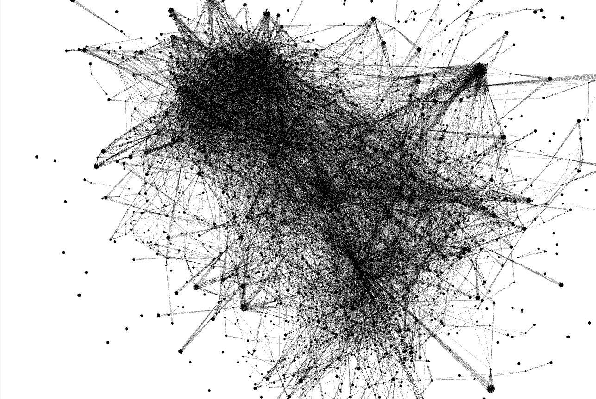
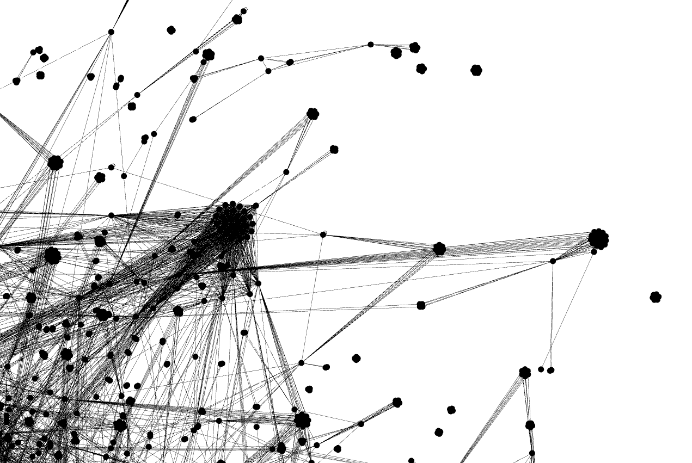
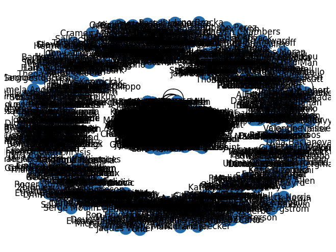

= 3. Social Network Analysis 


== Task


* Use an existing https://archive.ics.uci.edu/ml/datasets/Movie[Movie dataset]
** Focus on „casts“ - data that provide information about actors in movies
** You can also use already converted data to link:files/casts.zip[csv] from https://github.com/cernoch/movies
* Convert „casts“ data to a graph
** Create a node for each actor
** Create an edge if two actors appeared in the same movie
* Perform Social Network Analysis
** Compute general statistics
** Identify key players using centrality measures
** Identify clusters/communities in graph
** Compute „Kevin Bacon“ number for each actor with selected key player
** Visualise important aspects of the analysis
** Compute graph embeddings and report results 


== Instructions for submitting


In your repository provide the following information:

* Provide general statistics about the dataset
** e.g. number of nodes and edges, density, number of components
* Provide list of top key players using different centralities
* Describe top clusters/communities
* Describe „Kevin Bacon“ numbers
** e.g. top actors with the highest/lowest number
** average number
* Insert visualisations from networkx/Gephi (images/screenshots)
** for visualisation you can use only subset of actors/movies e.g. movies from specific category, movies with max 5 actors etc.
* Describe results using graph embeddings
** e.g. similar nodes to selected key players/movies etc.
* Insert a file with the graph exported to a GEXF format
** All computed values should be present as attributes
* Provide your implementation
* Comment on
** issues during the design/implementation
** ideas for extensions/improvements/future work


== Solution

- First of all, I loaded the CSV file using the pandas library and created a graph from it using the networkx library. The CSV file is really large, so I decide to work only with a subset of nodes (10000 nodes).
- Then I computed general statistics:

[source,txt]
----
Number of nodes: 5832
Maximum degree of node: 794
Minimum degree of node: 0
Average degree of nodes: 10.549039780521262
Number of edges: 30761
Graph density: 0.0018091304717066134
Number of components: 301
----

- After that, I computed the centralities of all nodes using different functions (degree_centrality closeness_centrality, betweenness_centrality, eigenvector_centrality). These centralities are added to nodes like attributes and can be found in the  `result/graph.gexf` file. And I saved 10 nodes with the highest centrality for each centrality function to the `result/centralitiesOutput.txt` file.
- The next step was community analytics. I added the next attribute to all nodes - communityId and visualized the communities in a plot, but thanks to the large number of nodes (10000) they are overlapping. All communities are logged in the `result/communitiesOutput.txt` file.
- Next, I computed Kevin Bacon's number of all nodes and added it as an attribute. This number represents the shortest path to node Kevin Bacon. The graph contains several components, so I set this number to infinity for nodes, which are not in the same component as Kevin Bacons.
    ```
    Average Kevin Bacon number of nodes with finite Kevin Bacon number: 3.6641509433962263
    Number of nodes with finite Kevin Bacon number: 5035
    ```
- The entire graph is saved in `result/graph.gexf. I visualized this file using Gephi software.





- I also visualized the graph using several Python functions, all the visualizations are in the Jupyter notebook. The last visualization is created by graph embedding into a vector space.



- Feature improvements: some graphs are unreadable thanks to their size, but I don't want to reduce the number of nodes because I would have to select the data more carefully. For example when I used smaller dataset Kevin Bacon was only in 2-node component.