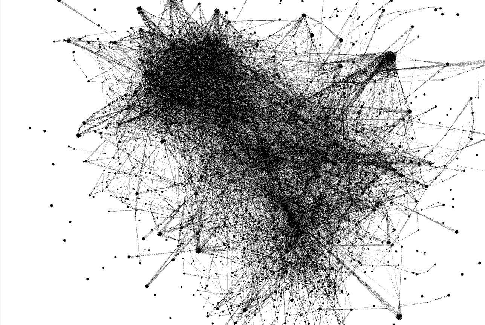
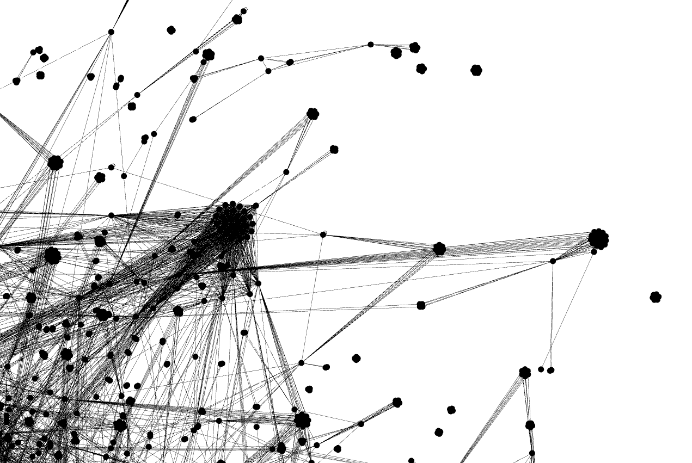
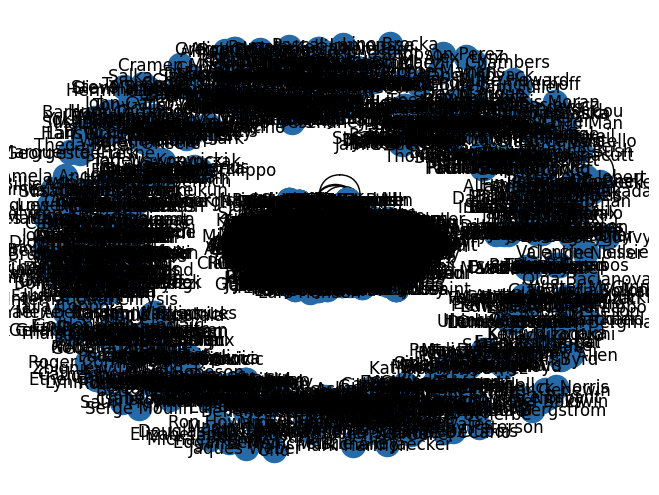

# HW 3 - Social network analysis

- First of all, I loaded the CSV file using the pandas library and created a graph from it using the networkx library. The CSV file is really large, so I decide to work only with a subset of nodes (10000 nodes).
- Then I computed general statistics:
    ```
    Number of nodes: 5832
    Maximum degree of node: 794
    Minimum degree of node: 0
    Average degree of nodes: 10.549039780521262
    Number of edges: 30761
    Graph density: 0.0018091304717066134
    Number of components: 301
    ```
- After that, I computed the centralities of all nodes using different functions (degree_centrality closeness_centrality, betweenness_centrality, eigenvector_centrality). These centralities are added to nodes like attributes and can be found in the  `result/graph.gexf` file. And I saved 10 nodes with the highest centrality for each centrality function to the `result/centralitiesOutput.txt` file.
- The next step was community analytics. I added the next attribute to all nodes - communityId and visualized the communities in a plot, but thanks to the large number of nodes (10000) they are overlapping. All communities are logged in the `result/communitiesOutput.txt` file.
- Next, I computed Kevin Bacon's number of all nodes and added it as an attribute. This number represents the shortest path to node Kevin Bacon. The graph contains several components, so I set this number to infinity for nodes, which are not in the same component as Kevin Bacons.
    ```
    Average Kevin Bacon number of nodes with finite Kevin Bacon number: 3.6641509433962263
    Number of nodes with finite Kevin Bacon number: 5035
    ```
- The entire graph is saved in `result/graph.gexf. I visualized this file using Gephi software.


- I also visualized the graph using several Python functions, all the visualizations are in the Jupyter notebook. The last visualization is created by graph embedding into a vector space.

- Feature improvements: some graphs are unreadable thanks to their size, but I don't want to reduce the number of nodes because I would have to select the data more carefully. For example when I used smaller dataset Kevin Bacon was only in 2-node component.